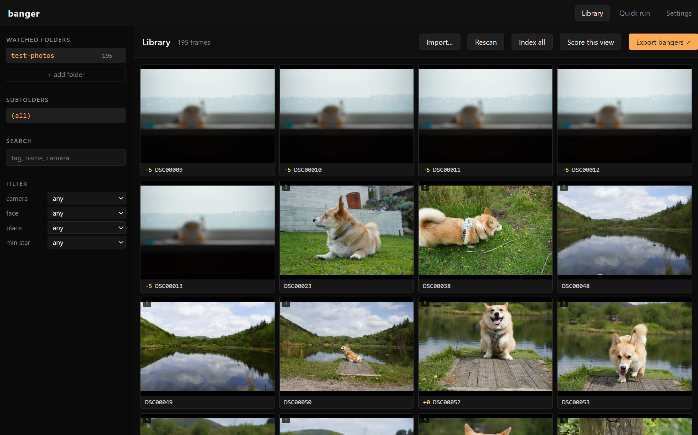
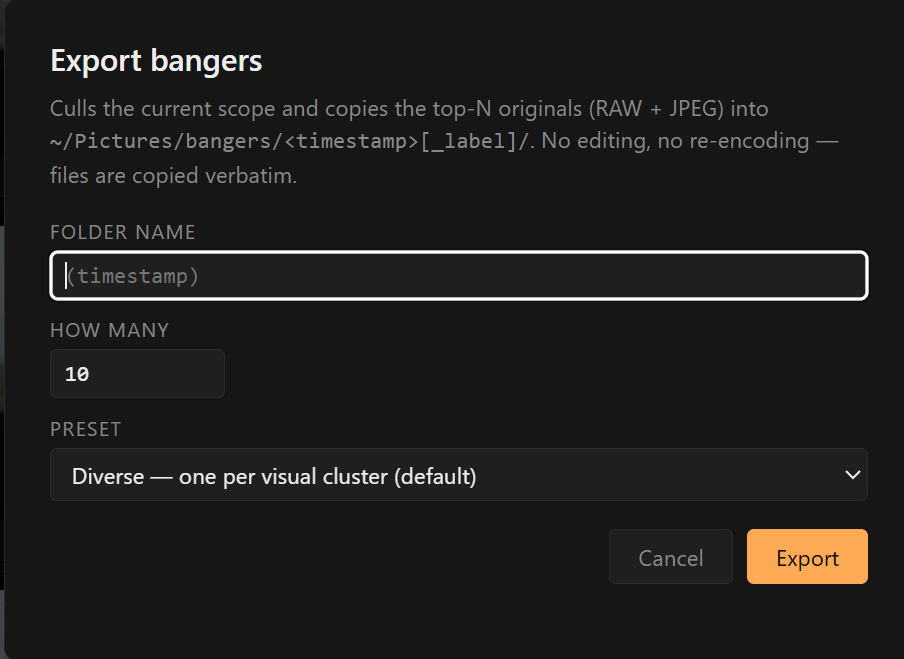
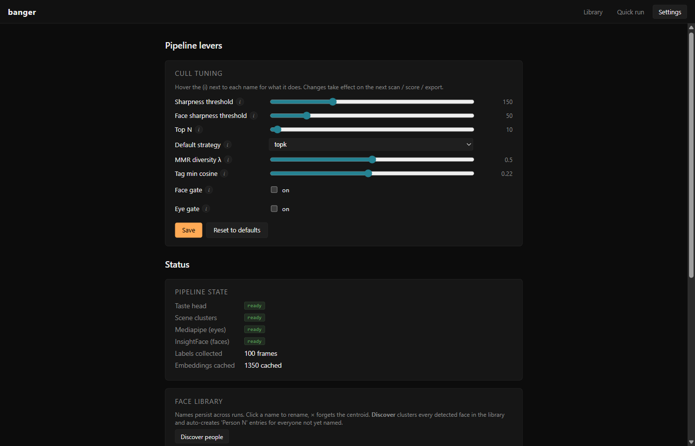
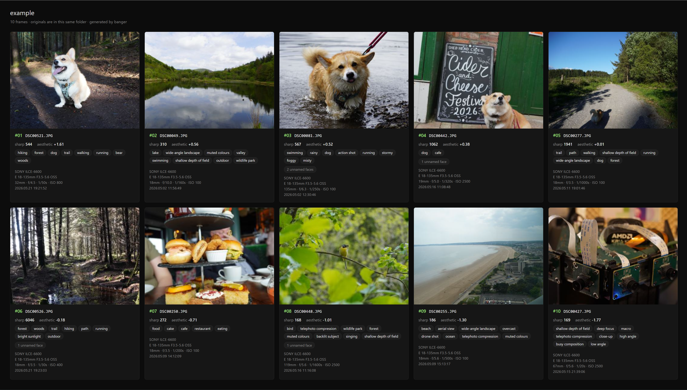

# banger

A local photo culler. Point it at the folders you already keep your photos in, hit Index all, then Export bangers, you get a folder of the keepers, copied byte-for-byte, with a self-contained HTML gallery showing why each one made the cut. No cloud, no upload, no account.

## The problem

I treat photography as a tool, not an art. To me it's documenting things I've seen, but quite often I feel like the photos I take don't reflect what I'm seeing. Until recently my tool of choice has been my Pixel. I picked up a 'real camera' to: 1. see if it takes better photos, and 2. see if it makes me take better photos.

Culling the resulting photos absolutely sucks though, which is what led me to build this. Most are near-duplicates anyway. Out-of-focus shots and anything that fails the aesthetic gate get culled automatically, and from there I can either ask for 10ish keepers out of a day of 100 to 200 frames, or cut that pile in half and manually cull the rest.

Aftershoot, Narrative Select, and Optyx all solve this commercially and they solve it well, but they're cloud-backed subscriptions that want your library uploaded, and at least one of them wants a phone in the loop. I don't want any of that. The photos already live in folders on my laptop. The keepers should come out as files in another folder.

So I built one. Banger is a local photo culler. Point it at the folders you already keep your photos in, hit Index all, then Export bangers. You get a folder of the keepers, copied byte-for-byte, with a self-contained HTML gallery showing why each one made the cut.

## Screenshots

**Library** — watched folders, search, filters, grid of indexed frames with `-5..+5` taste labels in the corner.



**Export bangers** — one modal, seven presets (Best / Diverse / Mixed / People / Landscapes / Pets / Food), one click to copy keepers out.



**Settings** — every pipeline lever as a slider with hover `(i)` tooltips. Save / Reset to defaults. Persists to `settings.json` in the state dir.



**Example output** — what the auto-generated `gallery.html` looks like: every keeper as a card with thumbnail, rank, filename, sharpness, aesthetic score, top tags, named faces, and EXIF.



A real banger output folder lives at [`public/example-export/`](public/example-export/): 10 JPEG keepers picked by the `kmeans` strategy from 195 indexed frames, plus the auto-generated [`gallery.html`](public/example-export/gallery.html) and [`manifest.json`](public/example-export/manifest.json).

## What it does

For every photo in every folder you watch, banger indexes:

- **Filename, sha256, path, mtime, EXIF** (camera body, lens, aperture, shutter, ISO, focal length + 35 mm equivalent, exposure comp, date taken, metering mode, flash).
- **GPS** parsed from EXIF, then **reverse-geocoded offline** to city / region / country (so "swansea" or "keswick" works as a search term).
- **CLIP embedding** (ViT-B/32), used as the universal feature vector for tags, scenes, and similarity.
- **5–10 tags** from a curated ~180-entry vocabulary across subjects, scenes, activities, lighting, aesthetic, weather. "hiking, couple, valley, smiling, drone shot" type results.
- **Quality metrics**: sharpness via Laplacian variance, exposure with shadow/highlight clipping + silhouette detection, contrast, colour harmony entropy, composition score via rule-of-thirds detection, leading lines via Hough, noise via Immerkaer, dynamic range in stops.
- **Faces**: insightface ArcFace embeddings + bounding boxes. Cross-frame DBSCAN clustering. Persistent name DB — name Beth once, every Beth photo in every folder gets tagged Beth forever.
- **Scene cluster** (KMeans on CLIP embeddings — your library's actual visual categories rather than guessed prompts).
- **Taste score** from a Ridge regressor trained on your -5..+5 hand-labels.

All of it lives in `~/.local/share/banger-pipeline/` — SQLite indices plus a per-frame JSON sidecar.

## Quickstart

```sh
python -m venv .venv
.venv\Scripts\activate                # Linux: source .venv/bin/activate
pip install torch --index-url https://download.pytorch.org/whl/cu126
pip install -e ".[dev,gui]"
pip install "transformers<5"

python -m banger gui                  # native desktop window
```

First launch auto-loads CLIP, fits scene clusters on any cached embeddings, backfills GPS / geocoding for any pre-indexed frames, and installs mediapipe in the background. A splash screen shows progress.

## The GUI

Five views, all native, no Chromium bundled:

### Library (home)

Sidebar: watched root folders with frame counts, subfolder tree, text search across tags / names / cameras / places, dropdown filters for camera / face / place / minimum star rating.

Grid: 4:3 thumbnails of every photo in the selected scope. Lazy-loaded. Click for the detail overlay.

Toolbar:
- **Import…** copies from any folder (SD card, camera mount point) into a destination, organised by date / camera / flat, with RAW+JPEG pairs kept together. Auto-adds destination to watched roots and scans.
- **Rescan** re-walks the selected root for new / changed / removed files.
- **Index all** runs the heavy pre-compute on every frame in every root: CLIP embedding, tags, insightface face detections, scene cluster assignment, taste head scoring. After this, culling and filtering are instant SQL/JSON reads.
- **Score this view** runs the cull pipeline (sharpness gate, dedup, selection by strategy) for the current scope. Runs in the background; bottom strip shows progress.
- **Export bangers ↗** culls the current scope and copies the top N originals to a dated folder. See below.

Empty state shows big "Open folder" and "Import from device" buttons.

### Detail overlay (click a photo)

Two-column. Hero image on the left, scrollable stats panel on the right showing:
- **Tags**: 5–10 CLIP zero-shot chips ("hiking", "couple", "wide-angle landscape").
- **Why it was picked**: aesthetic score + source, sharpness, scene preset, file kind.
- **Quality dims**: bars for exposure, contrast, colour harmony, composition, leading lines. Flags for clipped shadows/highlights, silhouette, monochrome.
- **Numbers**: noise σ, dynamic range in stops, mean luminance.
- **Faces**: thumbnails with click-to-name. Names persist via a centroid DB; the same person across folders auto-matches once named.
- **EXIF**: camera, lens, aperture, shutter, ISO, focal length (+ 35 mm equiv), exposure comp, date, metering, flash, dimensions, **location** (reverse-geocoded city / region / country plus GPS coords).
- **Source**: path + sha prefix.

### Export bangers (closing the loop)

The "I want to share these" workflow in one click. Available from both Results and Library toolbars.

Modal asks for:
- **Folder name** — empty defaults to a timestamp, type to append (e.g. `caminito-trip` → `2026-05-13_1718_caminito-trip/`).
- **How many bangers**.
- **Preset**, picking how the selection runs:
  - **Diverse** (default) — kmeans clustering on CLIP embeddings; one best frame per visual cluster. Portfolio variety.
  - **Best** — pure aesthetic top-N. No diversity penalty.
  - **Mixed** — MMR at λ=0.5; balances aesthetic with visual diversity.
  - **People** — clusters by face identity, picks one good shot per person across the batch.
  - **Landscapes** — kmeans + a gentle aesthetic-score bonus for frames whose tags include `mountain / valley / forest / beach / ocean / lake / wide-angle landscape / drone shot / ...`.
  - **Pets / wildlife** — same shape, biased toward `dog / cat / horse / bird / lion / tiger / deer / wolf / ...`.
  - **Food** — biased toward `food / drink / coffee / wine / cake / pizza / restaurant / cafe / kitchen / cooking`.

The subject presets nudge rather than filter: a +0.3 score boost lifts matching frames in the ranking, but everything else is still eligible.

Output:

```
~/Pictures/bangers/<YYYY-MM-DD_HHMM>[_label]/
  DSC00012.JPG                       originals copied verbatim
  DSC00012.ARW                       (RAW siblings come along automatically)
  DSC00013.JPG
  ...
  manifest.json                      per-pick stats (rank, sha, sharpness, aesthetic,
                                     tags, faces, EXIF) — no thumbnails
  gallery.html                       self-contained dark-themed HTML gallery,
                                     thumbnails embedded as base64, ready to share
```

When done, the folder opens in OS Explorer.

### Settings

**Pipeline levers** card with sliders / number inputs / dropdown / toggles for every cull knob, each with an `(i)` hover tooltip explaining what it does:

- **Sharpness threshold** — Laplacian-variance gate. Frames below this are dropped before scoring.
- **Face sharpness threshold** — per-face Laplacian variance for the face-aware gate.
- **Top N** — default export count.
- **Default strategy** — `kmeans` / `topk` / `mmr` / `faces`.
- **MMR diversity λ** — only used by the `mmr` strategy.
- **Tag min cosine** — CLIP cosine threshold for a tag to be applied to a frame.
- **Face gate** — also reject frames whose detected face is softer than the face-sharpness threshold.
- **Eye gate** — reject frames where someone's eyes appear closed (needs mediapipe).

Save / Reset to defaults. Persisted to `~/.local/share/banger-pipeline/settings.json`.

**Pipeline state**: badges for taste-head / scene-clusters / mediapipe / insightface readiness, label count, cache counts.

**Face library**: every named or auto-discovered person with a thumbnail and sample count. Rename, forget, or hit **Discover people** to DBSCAN every face embedding in the library and auto-create `Person 1`, `Person 2`, … entries for unnamed clusters.

### Quick run (formerly Welcome)

The original one-shot path: pick a folder, configure top-N + strategy + gates, run. Mostly useful for benchmarks and the labelling-UI link. The Library tab is the primary entrypoint now.

### Running

Detailed live progress for an active scoring job. Optional view — accessible via the bottom strip's "expand ↗" button.

## Background work

A thin progress strip at the bottom of the screen shows tagger + scoring-job progress when either is running. Click "expand ↗" to jump to the Running view for the active job. After a library scan, banger auto-kicks the tagger so new folders get embeddings + tags without a click. The "Index all" button does the heavier full pass.

The scoring runner has an in-flight job guard — clicking Export while a scoring job is already running for the same folder won't spawn a duplicate thread. The metadata sidecars and embedding `.npy` files are also locked per-sha against concurrent writes.

## Selection strategies (Score this view + CLI --strategy)

- **kmeans** (default) — visual clusters via KMeans on CLIP embeddings, one best per cluster. Portfolio variety.
- **faces** — cluster by face identity, one good shot per person, fill with kmeans for face-less frames. Best for groups / events.
- **mmr** — continuous diversity knob via `--diversity` (0 = max diversity, 1 = pure score).
- **topk** — pure aesthetic ranking, no diversity.

## Camera support

Single Sony body was the original target. Supported formats now (via libraw / rawpy):

- **Sony** (ARW)
- **Canon** (CR2, CR3)
- **Nikon** (NEF, NRW)
- **Fuji** (RAF)
- **Pentax** (PEF)
- **Olympus** (ORF)
- **Panasonic** (RW2)
- **Apple / Adobe / Pixel** (DNG)
- **Samsung** (SRW), **Sigma** (X3F), **Hasselblad** (3FR), **Phase One** (IIQ), **Leica** (RWL), **GoPro** (GPR)
- **HEIC / HEIF** (via optional `pip install pillow-heif`)
- Standard JPEG

Phone JPEGs (iPhone, Pixel, Android) work without RAW conversion.

## CLI

The GUI uses the same pipeline. The CLI exposes everything with more knobs:

```sh
python -m banger run ./photos -r --strategy faces --face-gate --eye-gate --xmp
python -m banger label ./photos +5 DSC00055
python -m banger train                              # Ridge head on labelled embeddings
python -m banger scenes fit -k 5                    # KMeans on cached embeddings
python -m banger scenes show                        # cluster summaries
python -m banger explain ./photos DSC00055 DSC00073 # side-by-side prompt cosines
python -m banger benchmark ./photos --vs facet      # writes benchmarks/<date>.md
python -m banger version                            # state + deps summary
python -m banger ui <folder>                        # labelling UI only (used by Label view internally)
```

`banger run --output <dir>` copies the top-N originals (RAW + sibling JPEG) into the output folder, flat, alongside a `manifest.json`. No JPEG re-encoding, no edits applied.

## State

Everything banger learns lives under `~/.local/share/banger-pipeline/` (yes, on Windows too):

- `library.db` — SQLite frame index. Roots + frames tables with EXIF / camera / GPS / place columns.
- `labels.db` — your -5..+5 ratings, keyed by sha256.
- `faces.db` — named-face centroid DB with thumbnails.
- `taste_head.joblib` — Ridge regressor.
- `scene_kmeans.joblib` + `scene_kmeans.json` — scene cluster model.
- `settings.json` — pipeline lever values from the Settings tab.
- `embeddings/<sha>.npy` — CLIP image embeddings (the expensive cache).
- `metadata/<sha>.json` — sharpness, phash, EXIF timestamp, quality metrics, face detections, tags, scene cluster, taste score.
- `thumbs/<sha>.jpg`, `previews/<sha>.jpg` — UI assets.

Warm runs (everything cached) are ~7× faster than cold. `banger cache clear --kind embeddings` (or `--all`) to reset.

## Stack

Python 3.11+, PyTorch + CUDA, transformers (CLIP ViT-B/32), insightface (ArcFace), mediapipe (FaceMesh / EAR), rawpy, imagehash, scikit-learn, reverse_geocoder, Flask, pywebview. Optional: pillow-heif, gphoto2 (Linux).

128 tests, ~10 s.

## What banger deliberately doesn't do

- **No editor, no develop pipeline, no per-photo retouching.** Banger picks keepers; another tool develops them. Originals come out of Export bangers byte-identical to what went in.
- **No cloud sync, no web service, no phone app.** Files-only is the value proposition.
- **No video.** Library currently skips .mp4 etc.
- **Not multi-tenant.** Single-user app running on a single laptop.

## Limitations / scope

- The Linux camera daemon (gphoto2 + udev + systemd) is sketched but deferred until the user is on a Linux box.
- Video files (.mp4 etc.) aren't indexed — only photo formats. Pixel and DJI bodies mix videos with photo folders; for now they're invisible to the library.
- Multi-monitor edge cases in pywebview occasionally render slowly on first paint; reopen the window if you see it.

See `TODO.md` for the active open list.
